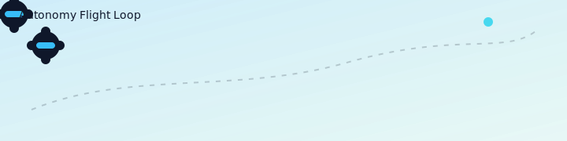

# Mainak Mondal

Robotics, autonomy, and networked systems. Building full-stack robotic products from simulation to deployment.

[crashxz.me](https://crashxz.me)

  

## Systems That Ship

- **MINDCAV AutoLLM Dashboard** — CARLA AI-in-the-loop control plane with FastAPI + React, WebRTC telemetry, and dataset capture.  
  https://github.com/CrashxZ/AutoLLM
- **5G RAN Dashboard (srsRAN + OAI)** — unified telemetry schema, realtime UE views, and Vercel-hosted ingest API.  
  https://github.com/CrashxZ/UniDash5g
- **Gym Reps Tracker** — Vite + React workout planner with Chart.js progress tracking.  
  https://github.com/CrashxZ/GymTrack
- **DJI IR + AprilTag Tracking** — ROS-based follow/landing workflows for DJI A3/N3.  
  https://github.com/CrashxZ/DJIFollowMe
- **Tello Coordinate System Helper** — ENU/NED helpers for DJI Tello commands.  
  https://github.com/CrashxZ/TelloCoordinateSystem

## Focus Areas

- Autonomous robotics (UAV/UGV)
- CARLA + ROS orchestration
- V2X / 5G telemetry pipelines
- Perception-driven control loops

## Contact

- Website: https://crashxz.me
- LinkedIn: https://www.linkedin.com/in/mainakm/
